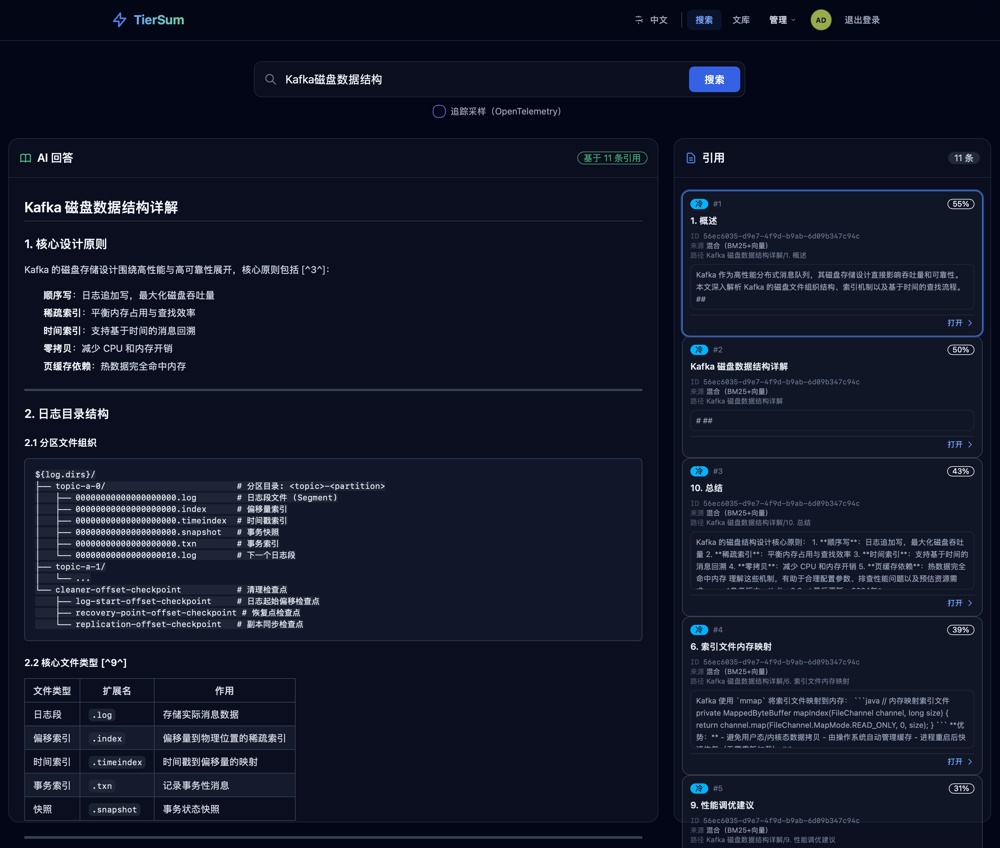

# TierSum

> **分层摘要知识库** —— 基于多层抽象与热/冷文档分层的文档检索系统；**不采用**将全文任意切碎后再做向量检索的典型 RAG 流程，而是通过分层摘要与标签导航组织知识。

[Go Version](https://golang.org) · [MCP Protocol](https://modelcontextprotocol.io) · [License](LICENSE)

[English](README.md) | [简体中文](README_zh.md)

---

## 产品介绍

传统 RAG 往往把文档切成任意片段，**层级语境与结构语义容易丢失**。**TierSum 通过分层摘要 + 标签导航保留知识结构**：

```
┌─────────────────────────────────────────────────────────────┐
│  主题 Topics（由 /topics/regroup 从目录刷新）                  │
│  ├── Cloud Native                                           │
│  │      └── 目录标签: kubernetes, docker, helm                 │
│  └── Programming Languages                                  │
│         └── 目录标签: golang, python, rust                    │
└─────────────────────────────────────────────────────────────┘
                              │
                              ▼
┌─────────────────────────────────────┐
│  Document Summary                   │  ← 全局（文档级）视角
├─────────────────────────────────────┤
│  Chapter Summary                    │  ← 结构（章节级）视角
├─────────────────────────────────────┤
│  Source Text                        │  ← 原文
└─────────────────────────────────────┘
```

**查询沿层级逐步收窄**：**标签 → 文档 → 章节**（目录标签很多时可先经 **主题** 收窄），每步 LLM 相关性评分；**不是**仅靠向量相似度「猜」片段 —— 而是 **可解释的层级导航**。

---

## 核心特性

| 特性 | 说明 |
|------|------|
| **热/冷分层** | 热：LLM 语义分析章节抽取 → 渐进式查询与预摘要语义层；冷：Markdown 标题章节抽取 → BM25 倒排索引 + 向量混合检索。均以章节为粒度保证语义完整性（非固定尺寸切块） |
| **三级摘要** | 文档 → 章节 → 原文，由 LLM 生成 |
| **渐进式查询** | 标签 → 文档 → 章节；目录标签很多时可先经 **主题** 收窄 |
| **BM25 + 向量混合** | 对冷文档按 **章节** 建索引，命中返回 **整章正文** |
| **双接口** | REST API + MCP，便于智能体集成 |
| **Web 界面** | Vue 3 CDN + Tailwind + DaisyUI 暗色主题 |
| **Markdown 优先** | 针对 `.md` 优化；可扩展其它格式 |

## 搜索界面预览



---

## 快速开始

```bash
# 1. 克隆并配置
git clone https://github.com/tiersum/tiersum.git && cd tiersum
cp configs/config.example.yaml configs/config.yaml

# 2. 设置 LLM API Key
export OPENAI_API_KEY="your-api-key"

# 3. 构建并运行
make build && make run
```

服务启动在 `http://localhost:8080/`，包含：
- **Web UI** — `http://localhost:8080/`
- **REST API** — `http://localhost:8080/api/v1`
- **MCP SSE** — `http://localhost:8080/mcp/sse`

首次启动时访问 `/init` 创建管理员用户。响应中 **仅显示一次**：
- **管理员访问令牌**（`ts_u_…`）— 用于网页登录
- **初始 API Key**（`tsk_live_…`）— 用于脚本和自动化

请妥善保存，服务器不再明文返回。

详细安装说明（Docker、PostgreSQL、MiniLM 向量）见 [docs/getting-started/installation.md](docs/getting-started/installation.md)。  
配置选项（LLM 提供商、配额、分层阈值）见 [docs/getting-started/configuration.md](docs/getting-started/configuration.md)。

---

## 文档

| 主题 | 文档 |
|------|------|
| **安装指南** | [docs/getting-started/installation.md](docs/getting-started/installation.md) |
| **配置参考** | [docs/getting-started/configuration.md](docs/getting-started/configuration.md) |
| **仓库结构** | [docs/getting-started/project-structure.md](docs/getting-started/project-structure.md) |
| **开发指南** | [docs/getting-started/development.md](docs/getting-started/development.md) |
| **架构设计** | [docs/design/architecture.md](docs/design/architecture.md) |
| **权限与认证** | [docs/design/auth-and-permissions.md](docs/design/auth-and-permissions.md) |
| **核心 API 流程** | [docs/algorithms/core-api-flows.md](docs/algorithms/core-api-flows.md) |
| **冷文档索引** | [docs/algorithms/cold-index/cold-index.zh.md](docs/algorithms/cold-index/cold-index.zh.md) |
| **Web 界面** | [docs/ui/web-ui.md](docs/ui/web-ui.md) |
| **路线图** | [docs/planning/roadmap.md](docs/planning/roadmap.md) |

---

## 架构

TierSum 采用 **五层架构** + **接口与实现分离**：

```
Client → API → Service → Storage → Client (LLM)
```

**核心原则**：Interface+Impl 模式、严格分层边界、依赖注入统一在 `internal/di/container.go` 组装。

📚 **完整架构说明：** [docs/design/architecture.md](docs/design/architecture.md)  
📚 **代码约定：** [AGENTS.md](AGENTS.md)

---

## API 快速示例

```bash
# 设置 API Key（初始化时仅显示一次）
export TIERSUM_API_KEY='tsk_live_...'

# 录入文档
curl -X POST http://localhost:8080/api/v1/documents \
  -H "X-API-Key: $TIERSUM_API_KEY" \
  -H "Content-Type: application/json" \
  -d '{"title":"Kubernetes","content":"# Kubernetes...","format":"markdown"}'

# 渐进式查询（同时搜索热/冷文档）
curl -X POST http://localhost:8080/api/v1/query/progressive \
  -H "X-API-Key: $TIERSUM_API_KEY" \
  -H "Content-Type: application/json" \
  -d '{"question":"How does kube-scheduler work?","max_results":10}'
```

完整 API 参考与 MCP 工具见 [docs/algorithms/core-api-flows.md](docs/algorithms/core-api-flows.md)。

---

## 贡献

欢迎贡献。请参阅 [CONTRIBUTING.md](CONTRIBUTING.md)。

**适合入门的方向**：更多文档格式解析、本地 LLM 适配、Web UI 增强等。

---

## 许可证

[MIT License](LICENSE) © 2026 TierSum Contributors

---

## 致谢

- 思路受 [Anthropic's Contextual Retrieval](https://www.anthropic.com/news/contextual-retrieval) 启发
- [MCP 协议](https://modelcontextprotocol.io)（Anthropic）
- 构建使用 [Gin](https://gin-gonic.com)、[Goldmark](https://github.com/yuin/goldmark)、[Bleve](https://blevesearch.com)、[HNSW](https://github.com/coder/hnsw) 等（**具体依赖以 `go.mod` 与源码引用为准**）

---

### 翻译与一致性说明

- 本文与 [README.md](README.md) **同步意图**介绍产品；**行为细节以当前分支代码与 `AGENTS.md` 为准**。
- 术语对照：**Progressive Query** → 渐进式查询；**Hot/Cold** → 热/冷（文档分层）；冷索引命中单位 → **章节**（整章正文）；**tier** → 层级/档。
- 英文 README 中的 **URL、JSON 字段名、工具名** 保持英文，便于直接复制调用。
